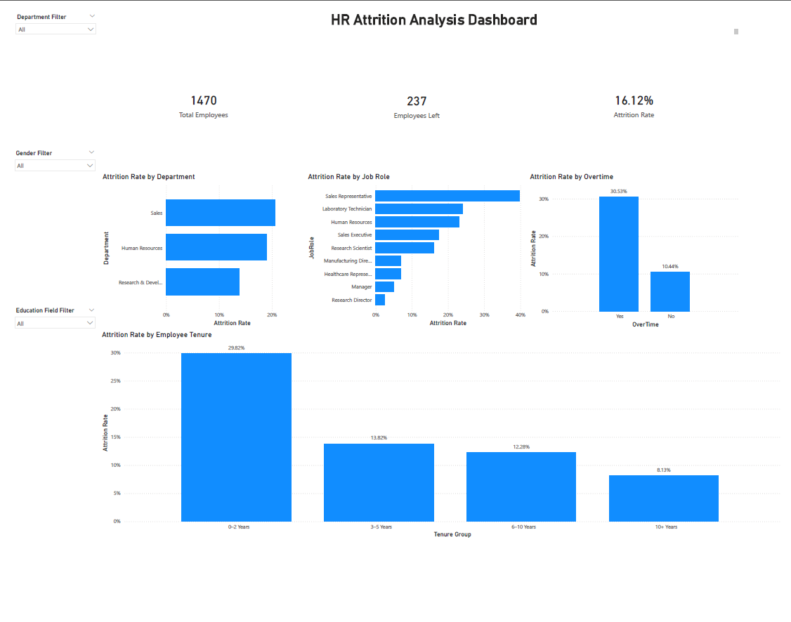

# HR Attrition SQL Analysis

## Project Overview

This project analyzes employee attrition patterns using PostgreSQL and the IBM HR Analytics Employee Attrition dataset. The goal is to identify the major factors associated with employee turnover and translate the findings into business-focused insights.

## Dataset

**Dataset:** IBM HR Analytics Employee Attrition

**Rows:** 1,470

**Columns:** 35

**Tools Used:** PostgreSQL, pgAdmin, VS Code

## Business Questions

This project answers the following questions:

- What is the overall employee attrition rate?
- Which departments have the highest attrition rates?
- Does working overtime increase the likelihood of attrition?
- Which job roles have the highest attrition rates?
- Does monthly income relate to attrition?
- How does job satisfaction relate to attrition?
- Which tenure group is most at risk of leaving?

## Key Findings

- Overall attrition rate is 16.12%
- Sales department shows the highest attrition rate 20.63%
- Employees working overtime have much higher attrition 30.53% compared to 10.44% for those who do not
- Sales Representatives have the highest job role attrition 39.76%
- Low income employees show higher attrition 28.61%
- Employees with low job satisfaction show higher attrition 22.84%
- Employees with 0–2 years tenure are most likely to leave 29.82%

## SQL Structure

The SQL analysis was organized into multiple scripts:

- 01_schema_table.sql
- 02_import_checks.sql
- 03_kpis.sql
- 04_driver_analysis.sql
- 05_views.sql

## SQL Views Created

The following reusable views were created:

- v_attrition_kpi
- v_department_attrition
- v_overtime_attrition

## Business Recommendations

Based on the findings, the organization should consider:

- improving early employee onboarding and support
- reducing overtime pressure where possible
- reviewing compensation for lower income roles
- improving employee engagement and satisfaction
- paying special attention to high turnover roles like Sales Representatives

## Power BI Dashboard

The analysis results were visualized using an interactive Power BI dashboard showing key attrition drivers across departments, job roles, overtime status, and tenure groups.

## Author

Pius Denilson Goodluck  
Aspiring Data Analyst building portfolio projects in SQL, Excel, and Power BI.